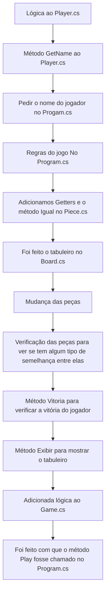

# Relatório Projeto 1

## Projeto realizado por

- Clara Antunes  22303299
- Daniela Peixoto  22305364

## Repartição de tarefas

*Clara Antunes*

- Trabalhou no Player.cs, Progam.cs, adicionou enumerações, Getters e o método Igual() ao programa Piece.cs e corrigiu juntamente erros no mesmo. No Markdown fez Descrição da solução e as referências.
  
*Daniela Peixoto*

- Trabalhou no Board.cs, adicionou os caracteres unicode no programa Pieces.cs. No Markdown Fez organização e os tópicos que faltavam.

**Trabalhamos em conjunto na lógica do Game.cs.**

## Reposiório Git utilizado

**[Git hub repositório de Projeto 1](https://github.com/cLuAntunes/Project1/tree/main)**

## Descrição da solução

Estruturamos o jogo em 4 classes:

- Board que representa e exibe o tabuleiro. Nessa classe estão as operações de colocar peças e verificar o estado do tabuleiro, se tem espaços ocupados, se alguém ganhou.
- Piece que armazena as características das peças, verifica se a peça tem semelhanças uma com a outra e devolver um caractere Unicode de acordo com a combinação de características de cada peça.
- Player armazena, recebe e retorna o nome dos jogadores.
- Game contém a lógica principal do jogo. Mantém o jogo ativo, solicita as peças aos jogadores e pede para que coloquem no tabuleiro e verifica e exibe uma mensagem de vitória.

No Program.cs, que é o ponto de entrada do jogo, colocamos as instruções para os jogadores e uma solicitação de nome para cada um.

## Referências

*ChatGTP*

- Pedimos que nos ajudasse no Game.cs, na parte do Parsing das características das peças.

   **Prompt: Como faço o parsing das peças?**

- Pedimos que nos ajudasse com o Método Exibir()

    **Prompt: Como posso exibir o tabuleiro no ecrã?**

## Fluxograma

